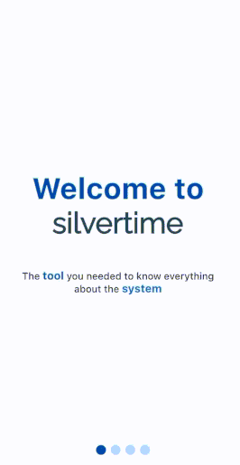

# SilverTime

The **tool** you needed to know everything about the ***system***.

SilverTime is a multi-platform tool that gives you the power to control and manage all status, interruptions and maintenances of your sistem.

## Getting started

To start with silvertime, get your credentials from your administrator, access with them and start monitoring!

**1. Filters in service status**

**2. How to read data**

### Tap a day to get more information!

**3. More information about each day**

- Get interruptions data with status and solutions

- Get status history

**4. Generating reports**

How about reporting at the moment that something is not working how it should be?

### Do it from your phone

**5. Get instant Notifications**

Get notified of all the activity that happens in the system.

